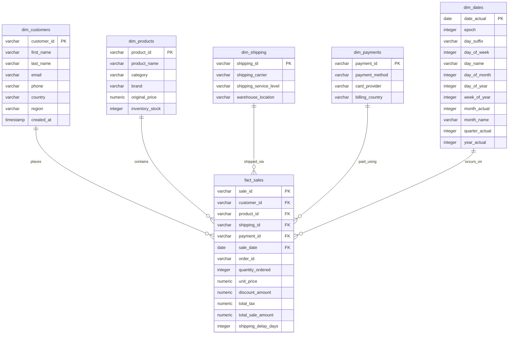

# End-to-End E-Commerce Data Platform
### Sales and Customer Analytics — A Data Engineering Capstone Project

> [!NOTE]
> **Authors & Project Team:**
> * **Vishwa Narayanaswamy** — Raw Data Ingestion, Cleaning, and Data Quality Framework 
> * **Koushik Raj Singh** — ETL Workflow Development, Apache Airflow Orchestration, Docker Deployment Data Warehouse Design, SQL Analytics, Power BI Dashboards, Documentation

---

## 📖 Project Overview

Modern e-commerce platforms generate massive volumes of high-velocity data across customer actions, transactions, product inventories, and logistics. Managing, processing, and analyzing this data manually is slow, error-prone, and unsustainable. 

This project delivers a **scalable, automated, and containerized End-to-End E-Commerce Data Platform**. The platform automates the ingest-transform-load lifecycle, breaking down data silos to build a single source of truth in a relational data warehouse, ultimately powering rich, interactive business intelligence (BI) dashboards in Power BI.

```mermaid
graph TD
    %% Styling
    classDef source fill:#F9F9FB,stroke:#3F51B5,stroke-width:2px;
    classDef ingest fill:#E8EAF6,stroke:#3F51B5,stroke-width:2px,stroke-dasharray: 5 5;
    classDef transform fill:#E3F2FD,stroke:#2196F3,stroke-width:2px;
    classDef store fill:#E0F2F1,stroke:#009688,stroke-width:3px;
    classDef visualize fill:#FFF3E0,stroke:#FF9800,stroke-width:2px;
    
    %% Sources
    subgraph Data Sources [E-Commerce Domains]
        S1["👤 Customer Data"]:::source
        S2["📦 Product Data"]:::source
        S3["💳 Sales Transactions"]:::source
        S4["🛒 Order Details"]:::source
        S5["💵 Payment Info"]:::source
        S6["🚚 Shipping Data"]:::source
    end

    %% Ingestion Layer
    subgraph Ingestion Layer [Apache NiFi / Python]
        I1["Ingest Raw Files/APIs"]:::ingest
        I2["Raw Landing Zone (Staging)"]:::ingest
    end
    
    %% Processing & Orchestration
    subgraph Processing Layer [Apache Spark / Pandas & Airflow]
        P1["Data Cleaning & Deduplication"]:::transform
        P2["Standardization & Feature Engineering"]:::transform
        P3["Orchestration Engine (Airflow DAGs)"]:::transform
    end

    %% Storage Layer
    subgraph Data Warehouse [PostgreSQL]
        DB[("E-Commerce Data Warehouse
        (Star Schema Model)")]:::store
    end

    %% Visualization Layer
    subgraph Analytics Layer [Power BI / Tableau]
        V1["Sales & Customer Analytics Dashboard"]:::visualize
    end

    %% Flow lines
    Data Sources --> Ingestion Layer
    Ingestion Layer --> P3
    P3 --> P1
    P1 --> P2
    P2 --> DB
    DB --> V1
    V1 --> V1
```

---

## 🎯 Objectives & Value Realization

* **Automate Data Ingestion**: Establish robust landing checkpoints for multi-source files.
* **Standardize & Cleanse**: Remove financial bounds anomalies, enforce PK/FK restrictions, and parse dynamic datetimes.
* **Idempotent Data Loading**: Load transactional facts safely into dimension keys via atomic database upserts.
* **Accelerate Business Intelligence**: Connect unified data models to Power BI, generating insights on monthly cohort retention, gross margin splits, and carrier performance latencies.

---

## ⚙️ Core Technology Stack

| Technology | Purpose | Strategic Value in Project |
| :--- | :--- | :--- |
| **Docker & Docker Compose** | Containerization & Portability | Encapsulates local execution services (Airflow, NiFi, Postgres) to guarantee portability. |
| **Apache NiFi** | Ingestion & Flow Management | Coordinates raw data movements from directories to ingestion checkpoints. |
| **Apache Airflow** | Workflow Orchestration | Defines, triggers, and retries the multi-stage ETL task sequence using Python-defined DAGs. |
| **Python (Pandas / PyTest)** | Transformations & Quality Testing | Executes data cleaning, schemas validation, deterministic mock generation, and assertions. |
| **PostgreSQL** | Relational Data Warehouse | Hosts the Star Schema transactional tables optimized for fast Analytical queries (OLAP). |
| **Power BI** | Business Intelligence | Connects to PostgreSQL to populate interactive retention and sales dashboards. |

---

## 🗄️ Data Warehouse Architecture (Star Schema)

The database schema is engineered as a **Star Schema** to simplify analytical queries and accelerate reporting speeds.



---

## 📂 Repository Directory Structure

```text
ecommerce-data-platform/
├── dags/                          # Apache Airflow DAGs
│   └── ecommerce_etl_pipeline.py
├── docker/                        # Docker configurations & scripts
│   └── postgres/
│       └── init-databases.sh      # Provisions multiple DBs (airflow + ecommerce_dw)
├── data/                          # Staging data directory
│   ├── quarantine/                # Outlier holding space for records failing validations
│   └── last_analytics_report.log  # Cached analytics verify runs
├── src/                           # Platform source code
│   ├── database/                  
│   │   ├── schema.sql             # Koushik: Table DDL, constraints & indexes
│   │   └── analytics_queries.sql  # Koushik: Cohort & Sales SQL analytics suite
│   ├── processing/                
│   │   └── etl.py                 # Vishwa : Main ETL loading pipeline
│   └── tests/                     
│       └── test_database.py       # Vishwa: Pytest quality assertion assertions
├── docker-compose.yml             # Containerized services orchestrator
├── requirements.txt               # Python package dependencies
├── .env.example                   # Environmental credentials template
├── CLOUD_DEPLOYMENT.md            # Step-by-step cloud deploy reference manual
└── README.md                      # Unified platform manual (This document!)
```

---

## 🛠️ Unified Local Setup Guide

### 1. Local Prerequisites
Ensure the following tools are installed:
* [Python 3.10+](https://www.python.org/downloads/)
* [PostgreSQL 15](https://www.postgresql.org/download/) (Installed natively via Homebrew or standard installers)

### 2. Python Virtual Environment Setup
To isolate project dependencies, spin up a python virtual environment:
```bash
# Create and activate environment
python3 -m venv venv
source venv/bin/activate

# Install required packages
pip install -r requirements.txt
```

### 3. Native Local Execution
If running without Docker, follow these steps:
```bash
# 1. Initialize local databases (run inside standard admin terminal)
psql -h localhost -d postgres -c "CREATE DATABASE ecommerce_dw;"

# 2. Deploy schema DDL (creates tables, relations, and indexes)
psql -h localhost -d ecommerce_dw -f src/database/schema.sql

# 3. Trigger Python Ingestion Pipeline
python3 src/processing/etl.py --input cleaned_retail_data.csv --user <YOUR_SUPERUSER_NAME>
```

---

## 🧪 Ingestion & Data Quality Test Framework

The ETL pipeline enforces rigorous data assertions before loading the data warehouse:

> [!WARNING]
> **Database Constraints & Rules:**
> 1. **Primary Key Integrity**: Null values are strictly forbidden in identifiers (`CustomerID`, `StockCode`, `InvoiceNo`, `sale_date`).
> 2. **Financial Bounds**: Values in `UnitPrice`, `Quantity`, and `Revenue` must be greater than zero.
> 3. **DateTime Accuracy**: Transaction dates cannot exceed the current local date, nor can they pre-date `2020-01-01`.
> 4. **Quarantine Gate**: Records failing these criteria are safely isolated in `/data/quarantine/bad_records.csv` to prevent pipeline failures.

To run quality validation checks:
```bash
pytest src/tests/
```

---

## ☁️ Step-by-Step Cloud Deployment (Neon / Supabase)

To make your database accessible to remote servers and Power BI, migrate your warehouse to the cloud.

```
┌─────────────────┐     ┌─────────────────┐     ┌─────────────────┐     ┌─────────────────┐
│  1. Cloud DB    │ ──> │   2. DDL Schema │ ──> │   3. Python ETL │ ──> │   4. Power BI   │
│  (Supabase/Neon)│     │     Migration   │     │    Cloud Load   │     │   Connection    │
└─────────────────┘     └─────────────────┘     └─────────────────┘     └─────────────────┘
```

### Step 1: Create a Serverless PostgreSQL Instance
1. Go to [Neon.tech](https://neon.tech) and create a free project named `ecommerce-dw`.
2. Locate your **Connection Parameters** in your dashboard:
   * **Host:** `ep-cool-breeze.us-east-2.aws.neon.tech`
   * **Database Name:** `neondb`
   * **User:** `neondb_owner`
   * **Password:** `[Your Generated Password]`

### Step 2: Deploy Schema Remotely
Run your DDL schema remotely on the cloud PostgreSQL instance:
```bash
psql -h <CLOUD_HOST> -d <CLOUD_DATABASE> -U <CLOUD_USER> -f src/database/schema.sql
```

### Step 3: Run Cloud Ingestion Pipeline
Execute your local ETL script, feeding your cloud instance credentials. The script automatically transforms your data and loads it over the internet:
```bash
python3 src/processing/etl.py \
  --input cleaned_retail_data.csv \
  --host <CLOUD_HOST> \
  --dbname <CLOUD_DATABASE> \
  --user <CLOUD_USER> \
  --password <CLOUD_PASSWORD>
```

### Step 4: Connect to Power BI
1. Open **Power BI Desktop** -> Click **Get Data** -> **PostgreSQL database**.
2. Input Server host (`<CLOUD_HOST>:5432`) and Database name (`<CLOUD_DATABASE>`).
3. Select **Import** connection mode for maximum performance.
4. Input database user name and password credentials, then click **Connect**.
5. Select all dimensions and fact tables, and click **Load**!
6. **For Web Service Auto-Refresh (Power BI Service):** Supabase and Neon are publicly accessible via strong passwords. You can toggle auto-refresh without configuring an On-Premises Data Gateway. For AWS RDS instances, ensure public incoming security rules allow Azure IP addresses.
