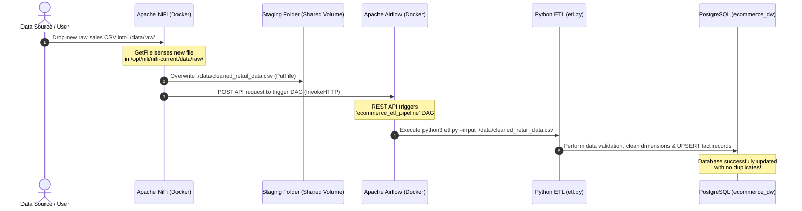

# Implementation Plan: Automating Raw Data Ingestion with Apache NiFi

We need to configure the E-Commerce Data Platform so that **whenever new raw CSV data is placed in a monitored directory (`./data/raw`), it is automatically ingested, processed, validated, and loaded into the PostgreSQL Data Warehouse**. 

We will use **Apache NiFi** as the ingestion gatekeeper, which will then trigger the **Apache Airflow** orchestration DAG to run our Python ETL pipeline.

---

## 🏗️ Architectural Flow

Here is how the automated, real-time ingestion pipeline will operate:



---

## 🛠️ Proposed Changes

To implement this robust, production-grade automated pipeline, we will make key updates across our docker services, Airflow DAG, and provide the Apache NiFi flow setup.

### 1. Docker Compose Integration

We need to update [docker-compose.yml](file:///Users/sandeepjohn/koushik/docker-compose.yml) to:
- Give Apache NiFi access to the shared `./data` directory so it can stage the incoming raw files.
- Enable unauthenticated API access in Apache Airflow for easy communication from NiFi inside our safe local Docker network.

#### [MODIFY] [docker-compose.yml](file:///Users/sandeepjohn/koushik/docker-compose.yml)

- Mount the full `./data` directory to Apache NiFi so it can write directly to `./data/cleaned_retail_data.csv`.
- Add `AIRFLOW__API__AUTH_BACKENDS: 'airflow.api.auth.backend.default'` to `x-airflow-common` to allow internal Docker container API calls.

```yaml
# In docker-compose.yml:
# 1. Update x-airflow-common environment:
AIRFLOW__API__AUTH_BACKENDS: 'airflow.api.auth.backend.default'

# 2. Update nifi volumes:
nifi:
  ...
  volumes:
    - nifi_data:/opt/nifi/nifi-current/data-internal
    - ./data:/opt/nifi/nifi-current/data
```

### 2. Airflow DAG Optimization

We must update [ecommerce_etl_pipeline.py](file:///Users/sandeepjohn/koushik/dags/ecommerce_etl_pipeline.py) to:
- Eliminate hardcoded host paths (`/Users/sandeepjohn/koushik/...`) which break inside the Airflow Docker container.
- Make path routing dynamic, referencing the workspace container mount path (`/opt/airflow/...`) dynamically while remaining compatible with native host executions!

#### [MODIFY] [ecommerce_etl_pipeline.py](file:///Users/sandeepjohn/koushik/dags/ecommerce_etl_pipeline.py)

- Dynamically calculate the base directory using `os.path.abspath(os.path.join(os.path.dirname(__file__), ".."))`.
- Reference shared directories `./data` and `./src` relatively.

---

## 🚚 Apache NiFi Flow Walkthrough

Once the containers are configured, you will log into Apache NiFi at `http://localhost:8080` (credentials: `admin` / `nifipassword123`) and assemble a simple 3-processor flow:

```
[GetFile]  ──(success)──>  [PutFile]  ──(success)──>  [InvokeHTTP]
```

### Processor Details:

1. **`GetFile`** (Listens to raw ingestion folder)
   - **Input Directory**: `/opt/nifi/nifi-current/data/raw`
   - **File Filter**: `.*\.csv`
   - **Keep Source File**: `false` (Moves the file so it only triggers once)

2. **`PutFile`** (Saves the raw file to staging)
   - **Directory**: `/opt/nifi/nifi-current/data` (which maps to host `./data` and Airflow staging)
   - **Conflict Resolution Strategy**: `replace`
   - **File Name**: `cleaned_retail_data.csv` (this matches the staging file name)

3. **`InvokeHTTP`** (Triggers Airflow immediately)
   - **HTTP Method**: `POST`
   - **Remote URL**: `http://airflow-webserver:8080/api/v1/dags/ecommerce_etl_pipeline/dagRuns`
   - **Content-Type**: `application/json`
   - **Request Body**: `{"conf": {}}`

---

## 🧪 Verification & Testing Plan

### 1. Ingestion Test
1. Place a new CSV dataset `new_sales.csv` in your host directory `./data/raw/`.
2. Observe NiFi automatically pick it up, rename and move it to `./data/cleaned_retail_data.csv`.
3. Check Apache Airflow at `http://localhost:8082` to see that a new DAG run was instantly triggered via API.
4. Verify the database tables have been loaded with new entries by checking the output in `./data/quarantine/last_analytics_report.log`.

### 2. Idempotency Test
1. Re-insert the same file into `./data/raw`.
2. Confirm the pipeline completes successfully and the database counts reflect correct upsert statements without duplicating revenues!

---

## ❓ Open Questions & User Review

> [!IMPORTANT]
> **Path Mappings and Docker Environment**
> 1. Currently, your Airflow DAG points to absolute host paths: `/Users/sandeepjohn/koushik/...`. Are you running the Airflow DAG inside the Docker container (`docker-compose up -d`) or are you running an Airflow instance directly on your Mac machine?
> 2. Let us know if you would like us to provide a pre-packaged NiFi `flow.json.gz` configuration file so that NiFi is automatically configured and running the moment you start the Docker container!
